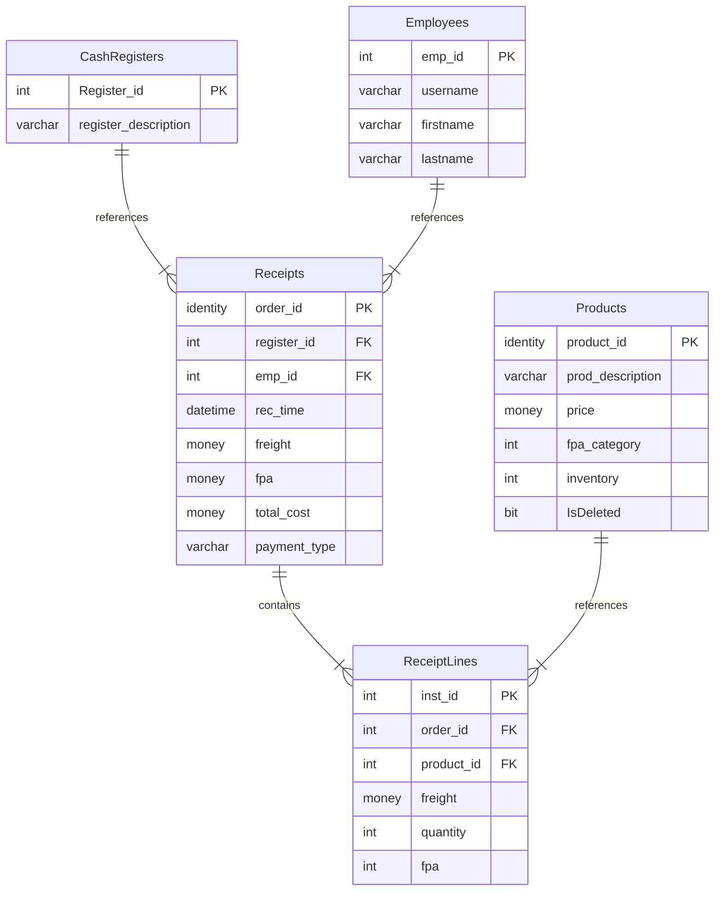
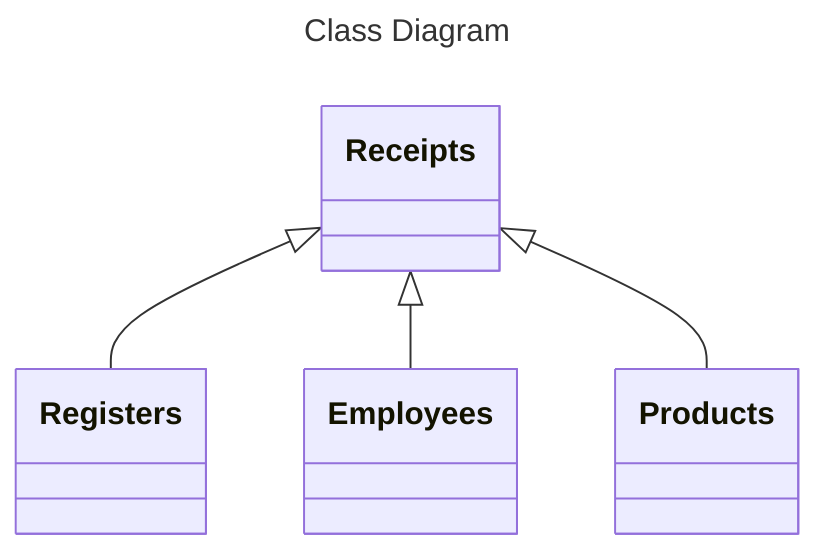
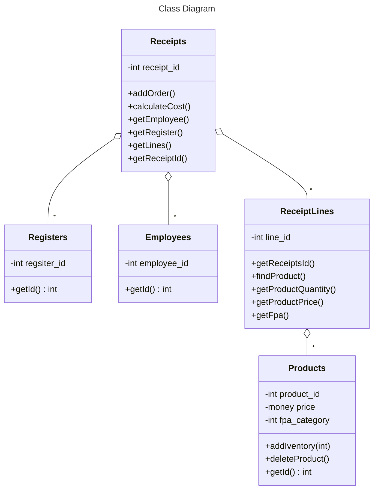
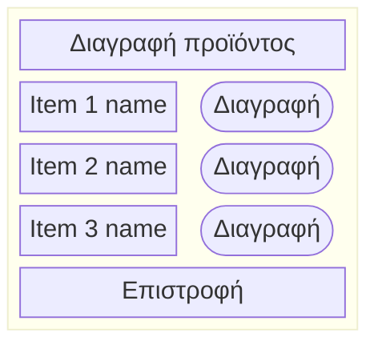

# Εργασία στον SQL Server

### ER  DIAGRAM:


### Σύντομη Περιγραφή:

Η εφαρμογή ασχολείται με την εκτύπωση αποδείξεων για ένα κατάστημα.
Στην απόδειξη εμφανίζονται ο κωδικός της ταμειακής μηχανής, ο κωδικός του χειριστή, η ημερομηνία και η ώρα που γίνεται η απόδειξη, το ποσό χωρίς ΦΠΑ, το ποσό του ΦΠΑ, το συνολικό ποσό για πληρωμή και ο τρόπος με τον οποίο πληρώνει ο πελάτης.

Επιπλέον εμφανίζονται οι κωδικοί των προϊόντων, η ποσότητα που αγοράστηκε, το καθαρό ποσό που κοστίζει η ποσότητα αυτή, το ποσοστό του ΦΠΑ και το συνολικό κόστος για την ποσότητα αυτή.

Το κατάστημα είναι ανοιχτό 9:00 με 21:00, αλλά δεν υπάρχει κάποιος περιορισμός για την εκτύπωση αποδείξεων σε άλλη ώρα.

Παραπάνω πληροφορίες για προϊόντα, παραγγελίες, υπαλλήλους και άλλα υπάρχουν στη βάση δεδομένων, δεν αναγράφονται στην απόδειξη.

## Βασικές Κλάσεις Συστήματος:




## Περιπτώσεις Χρήσης:

#### Μια περίπτωση χρήσης- Καταχώρηση παραγγελίας:

Ο πελάτης επιλέγει ορισμένα προϊόντα για αγορά. Ο υπάλληλος επιλέγει στην κύρια οθόνη το πλήκτρο για την δημιουργία παραγγελίας. Το σύστημα εμφανίζει την οθόνη για την παραγγελία με τα διαθέσιμα προϊόντα για πώληση. Ο υπάλληλος επιλέγει τα αντίστοιχα προϊόντα και τις ποσότητες του καθενός στην οθόνη και επιλέγει το πλήκρτο της καταχώρησης. Καταχωρείται η παραγγελία και ενημερώνονται οι πίνακες σχετικά με την ποσότητα των προϊόντων που είναι διαθέσιμη στο μαγαζί. Το σύστημα εκτυπώνει την απόδειξη στην οποία αναγράφονται τα στοιχεία που αναφέραμε και παραπάνω. Το σύστημα επιστρέφει στην κύρια οθόνη.

#### Μια περίπτωση χρήσης- Προσθήκη προϊόντων στο απόθεμα:

Ο υπάλληλος επιλέγει στην κύρια οθόνη το πλήκτρο για την προσθήκη προϊόντων. Το σύστημα εμφανίζει την οθόνη προσθήκης προϊόντων. Ο υπάλληλος επιλέγει το αντίστοιχο προϊόν και την ποσότητα για προσθήκη και επιλέγει το πλήκτρο ενημέρωση προϊόντος. Το σύστημα προσθέτει την αντίστοιχη ποσότητα στο απόθεμα για το προϊον. Το σύστημα επιστρέφει στην κεντρική οθόνη.

#### Μια περίπτωση χρήσης- Διαγραφή προϊόντος:

Ο υπάλληλος επιλέγει στην κεντρική οθόνη το πλήκτρο για την διαγραφή προϊόντος. Το σύστημα εμφανίζει την οθόνη διαγραφής προϊόντος. Ο υπάλληλος επιλέγει το προϊόν για διαγραφή και πατάει το πλήκτρο διαγραφής προϊόντος. Το σύστημα διαγράφει το προϊόν και επιστρέφει στην αρχική οθόνη.

## Κλάσεις Συστήματος λαμβάνοντας υπόψη τις περιπτώσεις χρήσης:




## Παραδείγματα οθόνης:

Ακολουθεί ένα παράδειγμα της κεντρικής οθόνης:
<!-- ```mermaid

block-beta


  columns 3


  B["Δημιουργία Παραγγελίας"]:3
  C["Προσθήκη προϊόντος"]:3
  A["Διαγραφή προϊόντος"]:3
  
``` -->


Ένα παράδειγμα οθόνης για τη διαγραφή προϊόντος:

### Πιθανές επεκτάσεις:


Μπορεί επιπλέον να κρατάει δεδομένα και για τους πελάτες και τις παραγγελίες του καθενός. Μπορούν να δημιουργηθούν κάποια ακόμα views σχετικά με τις τάσεις αγορών των πελατών.

Τα tables Receipts, ReceiptLines θα μπορούσαν ίσως να ενοποιηθούν με κάποιο τρόπο ή να βρεθεί καλύτερος τρόπος για την αναφορά ανάμεσα σε παραγγελία και τα διαφορετικά προϊόντα της κάθε παραγγελίας.

## Table function, stored procs:

Τα table functions σε αυτή την εργασία:
1) GetPopularProducts(n) - n πιο δημοφιλή προϊόντα
2) GetTotalProductTurnover(n) - n προϊόντα με τον μεγαλύτερο τζίρο
3) GetTotalFreightPerHour() - τζίρος ανά ώρα λειτουργίας

Τα stored procs σε αυτή την εργασία:
1) InsertReceipt - δημιουργία απόδειξης για την παραγγελία με json. 
2) AddProductUnits - προσθήκη n τεμαχίων στο προϊόν με κωδικό m:
παράδειγμα τρεξίματος για 5 τεμάχια στο προϊόν 1:
EXEC AddProductUnits @product_id = 1, @quantity = 5;
3) DeleteProduct - διαγραφή του προϊόντος n:
παράδειγμα τρεξίματος για το προϊόν 151:
EXEC DeleteProduct
@product_id = 151;


Όσον αφορά την εγκυρότητα των views , ένας τρόπος για να είμαστε πιο σίγουροι για τα αποτελέσματα τους είναι η χρήση SCHEMABINDING. Μπορούμε να αποφύγουμε πιθανά προβλήματα από διαγραφές δεδομένων, τα οποία θα επηρέαζαν τα views.

## SQL για δημιουργία πινάκων
```sql
USE [receipted]
GO
/****** Object:  Table [dbo].[CashRegisters]    Script Date: 10/4/2024 11:50:19 AM ******/
SET ANSI_NULLS ON
GO
SET QUOTED_IDENTIFIER ON
GO
CREATE TABLE [dbo].[CashRegisters](
	[register_id] [int] NOT NULL,
	[register_description] [varchar](255) NULL,
PRIMARY KEY CLUSTERED 
(
	[register_id] ASC
)WITH (PAD_INDEX = OFF, STATISTICS_NORECOMPUTE = OFF, IGNORE_DUP_KEY = OFF, ALLOW_ROW_LOCKS = ON, ALLOW_PAGE_LOCKS = ON, OPTIMIZE_FOR_SEQUENTIAL_KEY = OFF) ON [PRIMARY]
) ON [PRIMARY]
GO
/****** Object:  Table [dbo].[Employees]    Script Date: 10/4/2024 11:50:19 AM ******/
SET ANSI_NULLS ON
GO
SET QUOTED_IDENTIFIER ON
GO
CREATE TABLE [dbo].[Employees](
	[emp_id] [int] NOT NULL,
	[username] [varchar](255) NULL,
	[firstname] [varchar](255) NULL,
	[lastname] [varchar](255) NULL,
PRIMARY KEY CLUSTERED 
(
	[emp_id] ASC
)WITH (PAD_INDEX = OFF, STATISTICS_NORECOMPUTE = OFF, IGNORE_DUP_KEY = OFF, ALLOW_ROW_LOCKS = ON, ALLOW_PAGE_LOCKS = ON, OPTIMIZE_FOR_SEQUENTIAL_KEY = OFF) ON [PRIMARY]
) ON [PRIMARY]
GO
/****** Object:  Table [dbo].[Products]    Script Date: 10/4/2024 11:50:19 AM ******/
SET ANSI_NULLS ON
GO
SET QUOTED_IDENTIFIER ON
GO
CREATE TABLE [dbo].[Products](
	[product_id] [int] IDENTITY(1,1) NOT NULL,
	[prod_description] [varchar](255) NULL,
	[price] [money] NULL,
	[fpa_category] [int] NULL,
	[inventory] [int] NULL,
	[IsDeleted] [bit] NOT NULL,
PRIMARY KEY CLUSTERED 
(
	[product_id] ASC
)WITH (PAD_INDEX = OFF, STATISTICS_NORECOMPUTE = OFF, IGNORE_DUP_KEY = OFF, ALLOW_ROW_LOCKS = ON, ALLOW_PAGE_LOCKS = ON, OPTIMIZE_FOR_SEQUENTIAL_KEY = OFF) ON [PRIMARY]
) ON [PRIMARY]
GO
/****** Object:  Table [dbo].[ReceiptLines]    Script Date: 10/4/2024 11:50:19 AM ******/
SET ANSI_NULLS ON
GO
SET QUOTED_IDENTIFIER ON
GO
CREATE TABLE [dbo].[ReceiptLines](
	[inst_id] [int] IDENTITY(1,1) NOT NULL,
	[order_id] [int] NULL,
	[product_id] [int] NULL,
	[freight] [money] NULL,
	[quantity] [int] NULL,
	[fpa] [int] NULL,
PRIMARY KEY CLUSTERED 
(
	[inst_id] ASC
)WITH (PAD_INDEX = OFF, STATISTICS_NORECOMPUTE = OFF, IGNORE_DUP_KEY = OFF, ALLOW_ROW_LOCKS = ON, ALLOW_PAGE_LOCKS = ON, OPTIMIZE_FOR_SEQUENTIAL_KEY = OFF) ON [PRIMARY]
) ON [PRIMARY]
GO
/****** Object:  Table [dbo].[Receipts]    Script Date: 10/4/2024 11:50:19 AM ******/
SET ANSI_NULLS ON
GO
SET QUOTED_IDENTIFIER ON
GO
CREATE TABLE [dbo].[Receipts](
	[order_id] [int] IDENTITY(1,1) NOT NULL,
	[register_id] [int] NULL,
	[emp_id] [int] NULL,
	[rec_time] [datetime] NULL,
	[freight] [money] NULL,
	[fpa] [money] NULL,
	[total_cost] [money] NULL,
	[payment_type] [varchar](255) NULL,
PRIMARY KEY CLUSTERED 
(
	[order_id] ASC
)WITH (PAD_INDEX = OFF, STATISTICS_NORECOMPUTE = OFF, IGNORE_DUP_KEY = OFF, ALLOW_ROW_LOCKS = ON, ALLOW_PAGE_LOCKS = ON, OPTIMIZE_FOR_SEQUENTIAL_KEY = OFF) ON [PRIMARY]
) ON [PRIMARY]
GO
ALTER TABLE [dbo].[Products] ADD  DEFAULT ((0)) FOR [IsDeleted]
GO
ALTER TABLE [dbo].[ReceiptLines]  WITH CHECK ADD  CONSTRAINT [fk_order] FOREIGN KEY([order_id])
REFERENCES [dbo].[Receipts] ([order_id])
GO
ALTER TABLE [dbo].[ReceiptLines] CHECK CONSTRAINT [fk_order]
GO
ALTER TABLE [dbo].[ReceiptLines]  WITH CHECK ADD  CONSTRAINT [fk_prod] FOREIGN KEY([product_id])
REFERENCES [dbo].[Products] ([product_id])
GO
ALTER TABLE [dbo].[ReceiptLines] CHECK CONSTRAINT [fk_prod]
GO
ALTER TABLE [dbo].[Receipts]  WITH CHECK ADD  CONSTRAINT [fk_emp] FOREIGN KEY([emp_id])
REFERENCES [dbo].[Employees] ([emp_id])
GO
ALTER TABLE [dbo].[Receipts] CHECK CONSTRAINT [fk_emp]
GO
ALTER TABLE [dbo].[Receipts]  WITH CHECK ADD  CONSTRAINT [fk_register] FOREIGN KEY([register_id])
REFERENCES [dbo].[CashRegisters] ([register_id])
GO
ALTER TABLE [dbo].[Receipts] CHECK CONSTRAINT [fk_register]
GO
ALTER TABLE [dbo].[Products]  WITH CHECK ADD  CONSTRAINT [check_inventory] CHECK  (([inventory]>=(0)))
GO
ALTER TABLE [dbo].[Products] CHECK CONSTRAINT [check_inventory]
GO
```
## SQL για Γέμισμα Πινάκων
``` sql
DECLARE @counter INT = 1;
WHILE @counter <= 1000
BEGIN
    INSERT INTO Products( prod_description, price, fpa_category, inventory)
    VALUES (
		CHOOSE(ABS(CHECKSUM(NEWID())) % 5 + 1, 'book', 'chair', 'table', 'food', 'drink'),
		FLOOR(RAND() * 100) + 1,
		CHOOSE(ABS(CHECKSUM(NEWID())) % 2 + 1, 15, 24),
		FLOOR(RAND() * 600) + 1

    );
    SET @counter = @counter + 1;
END;

UPDATE PRODUCTS
SET fpa_category = 24
WHERE fpa_category IS NULL;

UPDATE PRODUCTS
SET prod_description = 'book'
WHERE prod_description IS NULL;

INSERT INTO CashRegisters(register_id, register_description)
VALUES (1, 'register1');
INSERT INTO CashRegisters(register_id, register_description)
VALUES (2, 'register2');
INSERT INTO CashRegisters(register_id, register_description)
VALUES (3, 'register3');

INSERT INTO Employees(emp_id, username, firstname, lastname)
VALUES (1, 'user1', 'John', 'Wilson');
INSERT INTO Employees(emp_id, username, firstname, lastname)
VALUES (2, 'user2', 'Marshall', 'Eriksen');
INSERT INTO Employees(emp_id, username, firstname, lastname)
VALUES (3, 'user3', 'Jenna', 'Anderson');
INSERT INTO Employees(emp_id, username, firstname, lastname)
VALUES (4, 'user4', 'Shinji', 'Ikari');
INSERT INTO Employees(emp_id, username, firstname, lastname)
VALUES (5, 'user5', 'Todd', 'Packer');
INSERT INTO Employees(emp_id, username, firstname, lastname)
VALUES (6, 'user6', 'Ryan', 'Howard');

DECLARE @counter INT = 1;
DECLARE @BaseDate DATETIME = DATEADD(HOUR, 9, CAST(CONVERT(DATE, GETDATE()) AS DATETIME));
DECLARE @EndDate DATETIME = DATEADD(HOUR, 21, CAST(CONVERT(DATE, GETDATE()) AS DATETIME));
WHILE @counter <= 100
BEGIN
    INSERT INTO Receipts(register_id, emp_id, rec_time, freight, fpa, total_cost, payment_type)
    VALUES (
      
		FLOOR(RAND() * 3) + 1,
		FLOOR(RAND() * 6) + 1,
		DATEADD(MINUTE, FLOOR(RAND() * DATEDIFF(MINUTE, @BaseDate, @EndDate)), @BaseDate),
		0.00,
		0.00,
		0.00,
		CHOOSE(ABS(CHECKSUM(NEWID())) % 2 + 1, 'card', 'cash', 'card')

    );
    SET @counter = @counter + 1;
END;

UPDATE Receipts
 SET payment_type = 'card'
WHERE payment_type IS NULL;

DECLARE @counter INT = 1;
WHILE @counter <= 100
BEGIN
    INSERT INTO ReceiptLines(order_id, product_id, freight, quantity)
    VALUES (
      
		FLOOR(RAND() * 100 + 1),
		FLOOR(RAND() * 1000 + 1),
		0.00,
		FLOOR(RAND() * 5 + 1)


    );
    SET @counter = @counter + 1;
END;

UPDATE o
SET o.fpa = (
    SELECT p.fpa_category
    FROM Products p
    WHERE p.product_id = o.product_id
)
FROM ReceiptLines o;

UPDATE o
SET o.freight = (
    SELECT p.price * O.quantity
    FROM Products p
    WHERE p.product_id = o.product_id
)
FROM ReceiptLines o;

UPDATE o
SET o.fpa = (
    SELECT SUM(oi.freight * oi.fpa / 100)
    FROM ReceiptLines oi
    WHERE oi.order_id = o.order_id
)
FROM Receipts o;

UPDATE o
SET o.freight = (
    SELECT SUM(oi.freight)
    FROM ReceiptLines oi
    WHERE oi.order_id = o.order_id
)
FROM Receipts o;

UPDATE Receipts
SET total_cost = freight + fpa;

INSERT INTO ReceiptLines(order_id, product_id, freight, quantity)
SELECT
    o.order_id,
    FLOOR(RAND() * 1000) + 1 AS product_id, 
    0.00 AS freight,               
    FLOOR(RAND() * 5 + 1) AS quantity     
FROM
    Receipts o
WHERE
    o.freight IS NULL;


DECLARE @counter INT = 1;
WHILE @counter <= 44
BEGIN
	UPDATE ReceiptLines
	SET product_id = FLOOR(RAND() * 1000) + 1 
	WHERE inst_id = 100 + @counter;

    SET @counter = @counter + 1;
END;

UPDATE o
SET o.fpa = (
    SELECT p.fpa_category
    FROM Products p
    WHERE p.product_id = o.product_id
)
FROM ReceiptLines o;

UPDATE o
SET o.freight = (
    SELECT p.price * O.quantity
    FROM Products p
    WHERE p.product_id = o.product_id
)
FROM ReceiptLines o;

UPDATE o
SET o.fpa = (
    SELECT SUM(oi.freight * oi.fpa / 100)
    FROM ReceiptLines oi
    WHERE oi.order_id = o.order_id
)
FROM Receipts o;

UPDATE o
SET o.freight = (
    SELECT SUM(oi.freight)
    FROM ReceiptLines oi
    WHERE oi.order_id = o.order_id
)
FROM Receipts o;

UPDATE Receipts
SET total_cost = freight + fpa;


``` 

## Stored Procedures
``` sql
CREATE PROCEDURE [dbo].[DeleteProduct]
@product_id int
AS
BEGIN 
BEGIN TRANSACTION;
BEGIN TRY
UPDATE Products
SET IsDeleted = 1
WHERE product_id = @product_id;

IF @@ROWCOUNT = 0
       BEGIN
  THROW 50001, 'ERROR, COULD NOT DELETE SELECTED PRODUCT ID', 1;
  END

COMMIT TRANSACTION;
END TRY
BEGIN CATCH 

 ROLLBACK TRANSACTION;
       
PRINT 'ERROR ' + ERROR_MESSAGE();

        
END CATCH
END;
GO
/****** Object:  StoredProcedure [dbo].[AddProductUnits]    Script Date: 9/19/2024 1:57:31 PM ******/
SET ANSI_NULLS ON
GO
SET QUOTED_IDENTIFIER ON
GO
CREATE PROC [dbo].[AddProductUnits]
 @product_id AS INT,
 @quantity AS INT
AS
BEGIN
        -- If the product exists, update the quantity
        UPDATE PRODUCTS
        SET inventory = inventory + @quantity
        WHERE product_id = @product_id;
    END
GO
/****** Object:  StoredProcedure [dbo].[InsertReceipt]    Script Date: 10/4/2024 11:50:19 AM ******/
SET ANSI_NULLS ON
GO
SET QUOTED_IDENTIFIER ON
GO
CREATE PROCEDURE [dbo].[InsertReceipt]
    @json NVARCHAR(MAX)
AS
BEGIN
    SET NOCOUNT ON;

    BEGIN TRY
        BEGIN TRANSACTION;

         
        INSERT INTO Receipts(register_id, emp_id, rec_time, freight, fpa, total_cost, payment_type)
       
        SELECT register_id, emp_id, rec_time, freight, fpa, total_cost, payment_type
        FROM OPENJSON(@json)
        WITH (
            register_id int '$.Order.register_id',
            emp_id int '$.Order.emp_id',
            rec_time datetime '$.Order.rec_time',
			freight money '$.Order.freight',
			fpa money '$.Order.fpa',
			total_cost money '$.Order.total_cost',
			payment_type VARCHAR(255) '$.Order.payment_type'

        );
		DECLARE @MaxOrderId INT;
		SELECT @MaxOrderId = MAX(order_id) FROM Receipts;
        
        INSERT INTO ReceiptLines(order_id, product_id, freight, quantity, fpa)
        SELECT @MaxOrderId, product_id, freight, quantity, fpa
        FROM OPENJSON(@json, '$.lines')
        WITH (
            product_id int '$.product_id',
            freight money '$.freight',
            quantity int '$.quantity',
			fpa int '$.fpa'
        );
		UPDATE o
		SET o.fpa = (
			SELECT p.fpa_category
			FROM Products p
			WHERE p.product_id = o.product_id
		)
		FROM ReceiptLines o;

		UPDATE o
		SET o.freight = (
			SELECT p.price * O.quantity
			FROM Products p
			WHERE p.product_id = o.product_id
		)
		FROM ReceiptLines o;
		UPDATE o
		SET o.fpa = (
			SELECT SUM(oi.freight * oi.fpa / 100)
			FROM ReceiptLines oi
			WHERE oi.order_id = o.order_id
		)
		FROM Receipts o;

		UPDATE o
		SET o.freight = (
			SELECT SUM(oi.freight)
			FROM ReceiptLines oi
			WHERE oi.order_id = o.order_id
		)
		FROM Receipts o;

		UPDATE Receipts
		SET total_cost = freight + fpa;

        
        COMMIT TRANSACTION;
    END TRY
    BEGIN CATCH
        
        ROLLBACK TRANSACTION;
        
        THROW;
    END CATCH
END;
GO
```
## Παράδειγμα Δημιουργίας απόδειξης με τη χρήση json:
```sql
DECLARE @jsonVariable NVARCHAR(MAX);

SET @jsonVariable = '
  {
  "Order": {
    "register_id":"2",
    "emp_id":"2",
    "rec_time":"2017-06-01T00:00:00",
	"freight":"0.00",
	"fpa":"0.00",
	"total_cost":"0.00",
	"payment_type":"cash"
    },
    "lines": [
      {
        "product_id": "15",
        "freight": "0.00",
        "quantity": "2",
        "fpa": "0"
      },
      {
        "product_id": "17",
        "freight": "0.00",
        "quantity": "4",
        "fpa": "0"
      }
    ]
  }

';

EXEC InsertReceipt
@json = @jsonVariable;
```

## Views
```sql
/****** Object:  UserDefinedFunction [dbo].[GetPopularProducts]    Script Date: 9/19/2024 1:57:31 PM ******/
SET ANSI_NULLS ON
GO
SET QUOTED_IDENTIFIER ON
GO
CREATE FUNCTION [dbo].[GetPopularProducts](@TopN INT)
RETURNS TABLE
AS
RETURN
(
    WITH RankedItems AS (
        SELECT
            oi.product_id,
            SUM(oi.quantity) AS total_quantity_sold,
            ROW_NUMBER() OVER (ORDER BY SUM(oi.quantity) DESC) AS rank
        FROM ReceiptLines oi
        GROUP BY oi.product_id
    )
    SELECT TOP (@TopN)
        ri.product_id,
        p.prod_description,
        ri.total_quantity_sold
    FROM RankedItems ri
    JOIN Products p
        ON ri.product_id = p.product_id
    ORDER BY ri.rank  
);
GO
/****** Object:  UserDefinedFunction [dbo].[GetTotalProductTurnover]    Script Date: 9/19/2024 1:57:31 PM ******/
SET ANSI_NULLS ON
GO
SET QUOTED_IDENTIFIER ON
GO
CREATE FUNCTION [dbo].[GetTotalProductTurnover](@TopN INT)
RETURNS TABLE
AS
RETURN
(
    WITH RankedItems AS (
        SELECT
            oi.product_id,
            SUM(oi.freight) AS total_value_of_sales,
            ROW_NUMBER() OVER (ORDER BY SUM(oi.freight) DESC) AS rank
        FROM ReceiptLines oi
        GROUP BY oi.product_id
    )
    SELECT TOP (@TopN)
        ri.product_id,
        p.prod_description,
        ri.total_value_of_sales
    FROM RankedItems ri
    JOIN Products p
        ON ri.product_id = p.product_id
    ORDER BY ri.rank  
);
GO
/****** Object:  UserDefinedFunction [dbo].[GetTotalFreightPerHour]    Script Date: 9/19/2024 1:57:31 PM ******/
SET ANSI_NULLS ON
GO
SET QUOTED_IDENTIFIER ON
GO
CREATE FUNCTION [dbo].[GetTotalFreightPerHour]()
RETURNS TABLE
AS
RETURN
(
    SELECT
        DATEPART(HOUR, o.rec_time) AS HourOfDay,  
        SUM(oi.freight) AS TotalFreight           
    FROM ReceiptLines oi
    JOIN Receipts o
        ON oi.order_id = o.order_id             
    GROUP BY DATEPART(HOUR, o.rec_time)           
);
GO
```

